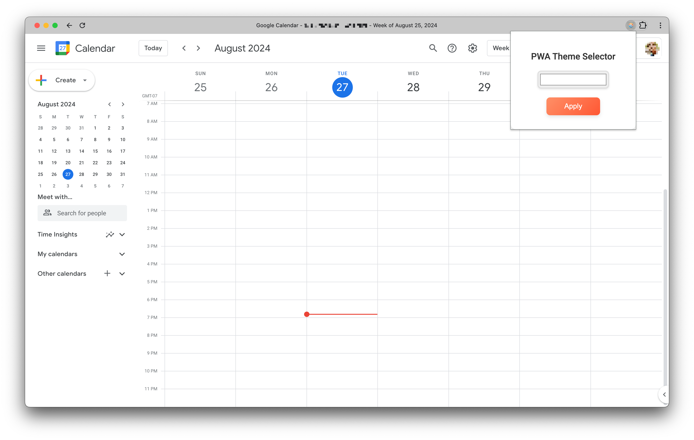
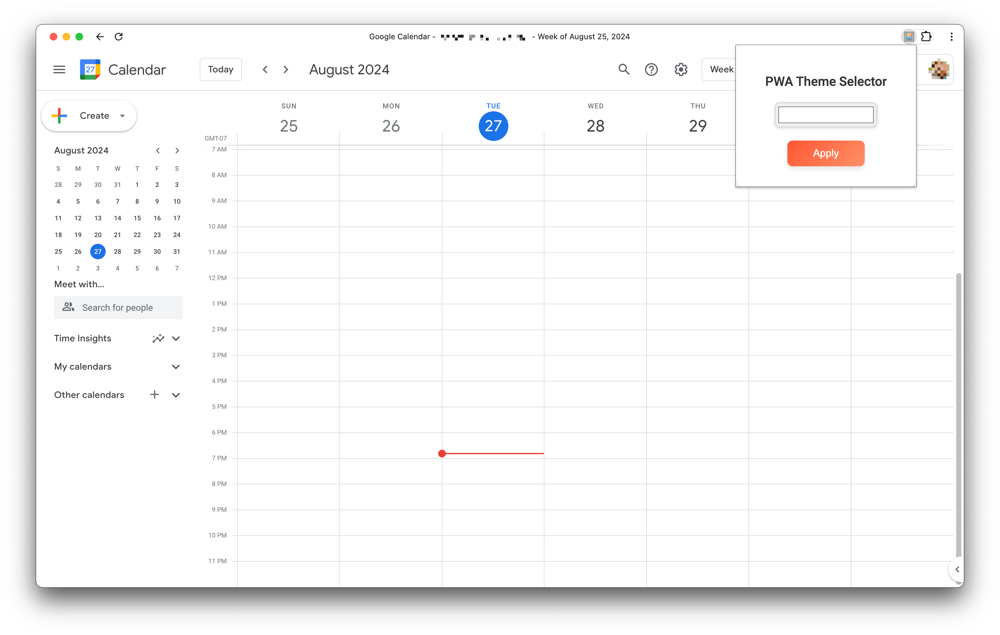

# PWA Theme Selector

## Overview

**PWA Theme Selector** is a Chrome extension that can customize the theme color (the color of the title bar) of Progressive Web App (PWA) Chrome Apps—i.e., these: https://support.google.com/chrome/answer/9658361

It lets you select different colors for different PWAs, which are remembered across sessions. All settings are stored locally; the extension has minimal permissions.

### For example... 
#### Before

#### After

### Features

- **Custom Theme Colors**: Set different theme colors for each PWA you use.
- **Persistent Settings**: The selected theme colors are saved locally and automatically applied whenever you revisit the PWA.
- **Easy-to-Use Interface**: Simple interface for selecting and applying theme colors, including a color picker.
- **Minimal Permissions**: Requires only the necessary permissions (`activeTab`, `scripting`, and `storage`).

## Installation

1. Download or clone this repository to your local machine.
2. Open Google Chrome and navigate to `chrome://extensions/`.
3. Enable "Developer mode" in the top-right corner.
4. Click "Load unpacked" and select the folder where you downloaded or cloned the repository.
5. The PWA Theme Selector extension should now be installed and visible in your extensions bar.

## Usage

1. **Open a PWA**: Navigate to any PWA in your Chrome browser.
2. **Click the Extension Icon**: Open the PWA Theme Selector by clicking its icon in the extensions bar.
3. **Select a Color**: Use the color picker to choose a custom theme color.
4. **Apply**: Click the "Apply" button to set the theme color. The selected color will be immediately applied and saved for future visits.
5. **Persistent Settings**: Your chosen color is stored locally and will be automatically applied whenever you visit the PWA again.

### Directory Structure

- **`manifest.json`**: The manifest file containing the extension’s metadata.
- **`content.js`**: The content script responsible for applying the theme color to PWAs.
- **`popup.html`**: The HTML file for the extension's popup interface.
- **`popup.js`**: The JavaScript file that handles user interactions in the popup.
- **`icons/`**: Directory containing the extension’s icons.